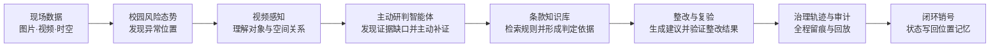
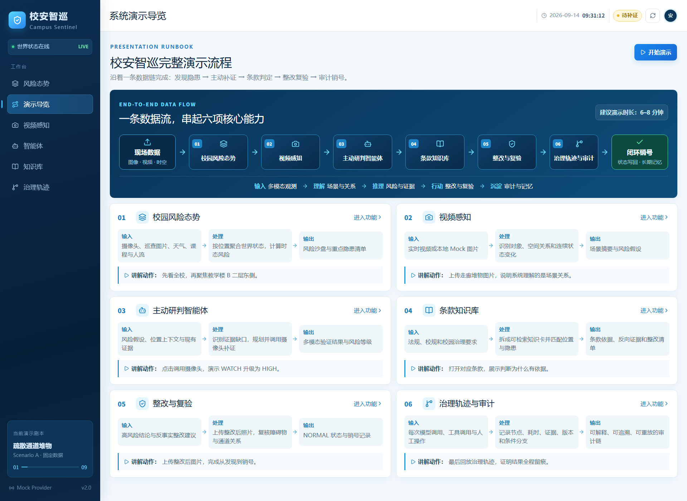
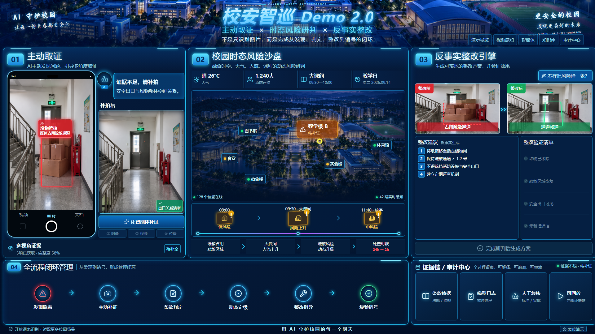
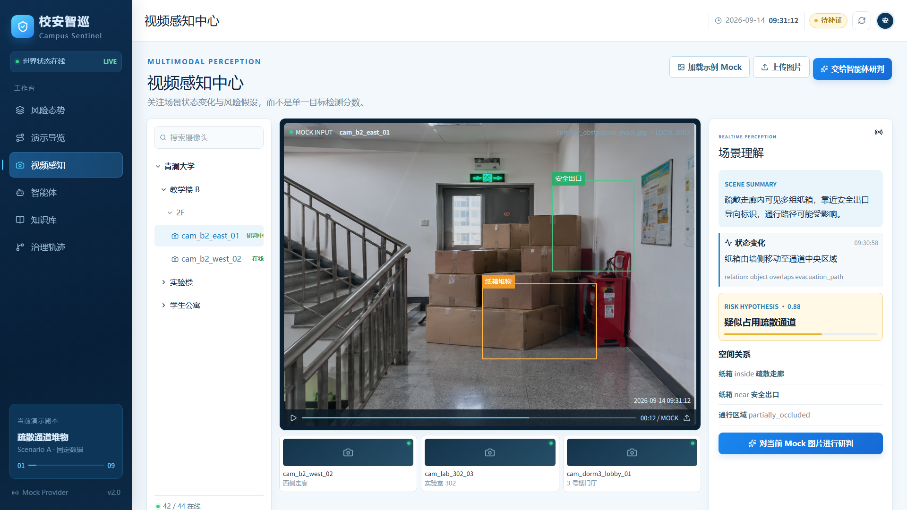
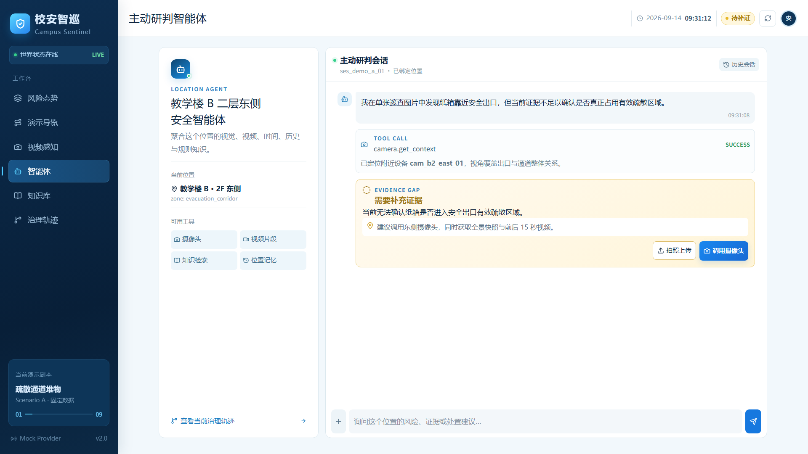
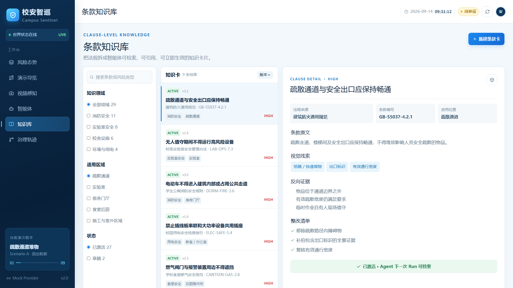
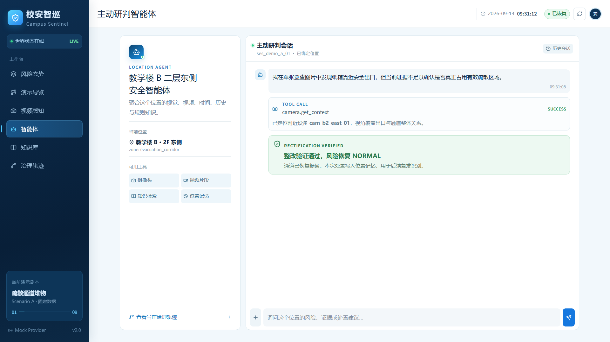
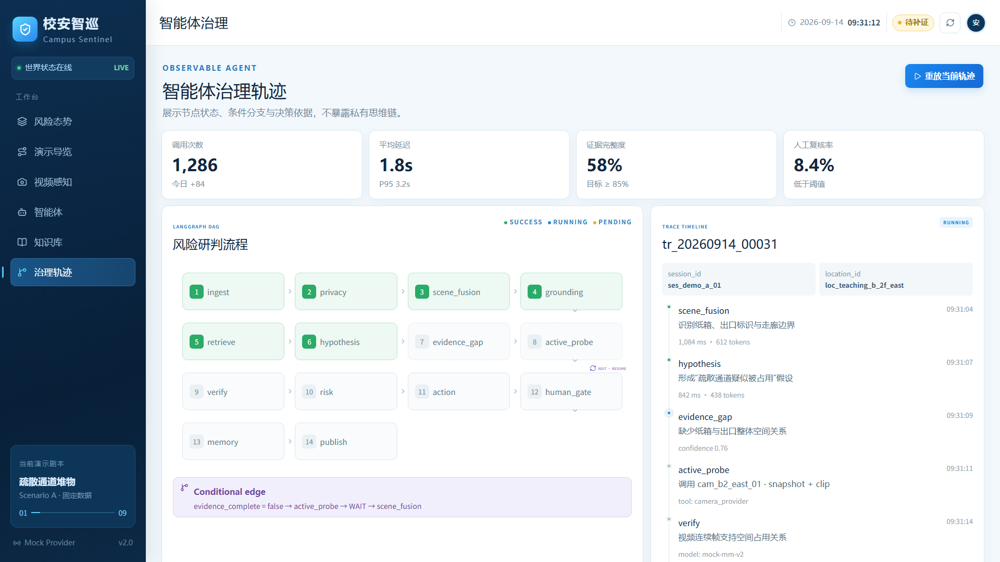

# 校安智巡 Demo 2.0 演示流程说明

## 一、建议演示节奏

建议总时长 6–8 分钟，始终围绕一个固定案例展开：**教学楼 B 二层东侧疏散通道出现纸箱堆物**。



演示主线：**发现隐患 → 形成风险假设 → 主动补证 → 条款判定 → 风险升级 → 整改复验 → 审计销号**。



## 二、功能 01：校园风险态势

演示页面：`http://localhost:5173/`

数据流：

```text
摄像头 / 巡查图片 / 天气 / 课程 / 人流
                    ↓
          按 location_id 聚合世界状态
                    ↓
       计算 risk_score 与 evidence_complete
                    ↓
          风险沙盘 + 重点隐患 + 时间趋势
```

- 输入：摄像头观测、巡查图片、校园位置、天气、课程时段和实时人流。
- 处理：系统以位置为核心融合多源数据，判断同一隐患在不同时间和人流条件下的风险变化。
- 输出：位置风险分、风险等级、证据完整度、重点区域和处置时限。
- 演示动作：先展示全校沙盘，再指向“教学楼 B”，说明当前状态为 `WATCH / 待补证`。
- 串场话术：系统不是只识别出“纸箱”，而是先把纸箱放进校园位置和时间上下文中理解。



## 三、功能 02：视频感知

演示页面：`http://localhost:5173/cameras`

数据流：

```text
实时视频或本地 Mock 图片 + 摄像头编号 + 时间戳
                         ↓
             对象检测与开放词表识别
                         ↓
           空间关系识别 + 连续状态变化
                         ↓
        scene_observation + risk_hypothesis
```

- 输入：实时视频流或本地上传的 Mock 图片，以及设备、位置和时间信息。
- 处理：识别纸箱、安全出口、疏散区域等对象，并计算 `inside`、`near`、`overlaps` 等空间关系。
- 输出：场景摘要、对象关系、状态变化、风险假设和置信度。
- 演示动作：点击“加载示例 Mock”或“上传图片”，然后点击“对当前 Mock 图片进行研判”。
- 串场话术：视频感知输出的不是一个检测框，而是智能体可继续推理的结构化场景事实。



## 四、功能 03：主动研判智能体

演示页面：`http://localhost:5173/agent`

数据流：

```text
risk_hypothesis + scene_observation + location_context
                           ↓
                   识别 evidence_gap
                           ↓
            规划 probe_task 并调用附近摄像头
                           ↓
      图片 + 视频 + 位置 + 时段 + 条款联合验证
                           ↓
                  risk_decision：HIGH
```

- 输入：初始风险假设、位置上下文、现有图像证据和可调用工具列表。
- 处理：智能体判断当前证据是否足够；证据不足时，主动选择合适摄像头并获取全景快照和前后 15 秒视频。
- 输出：补证任务、完整证据包、验证结果、风险等级和置信度。
- 演示动作：点击“调用摄像头”，等待约 3 秒，观察状态依次经过“规划补证、摄像头取证、跨模态验证、研判完成”。
- 串场话术：这是系统从“被动识别”走向“主动智能”的关键，模型会主动找回自己缺少的证据。



## 五、功能 04：条款知识库

演示页面：`http://localhost:5173/knowledge`

数据流：

```text
场景实体 + 位置类型 + 风险类型
               ↓
       检索条款知识卡与适用范围
               ↓
  匹配视觉线索、反向证据和风险等级
               ↓
clause_hit + 判定依据 + 整改清单
```

- 输入：隐患类型、对象关系、适用区域和风险上下文。
- 处理：从法规、校规和治理要求中检索对应知识卡，并同时检查支持证据与反向证据。
- 输出：条款编号、适用位置、风险等级、视觉线索、反向证据和整改清单。
- 演示动作：依次点击疏散通道、实验室、电气、食堂燃气等知识卡，展示右侧内容随条目切换。
- 串场话术：模型的判断不是黑盒分数，每一个结论都能回到具体条款和证据要求。



## 六、功能 05：整改与复验

演示入口：`http://localhost:5173/agent`

数据流：

```text
risk_decision + 条款要求 + 反事实整改建议
                       ↓
             生成可执行整改任务
                       ↓
        上传整改后图片并重新识别空间关系
                       ↓
 verification_result = PASSED
                       ↓
          风险恢复 NORMAL + 生成销号记录
```

- 输入：高风险结论、引用条款、整改建议和整改后的现场图片。
- 处理：验证堆物是否移除、疏散区域是否恢复、安全出口是否可见、是否出现新增遮挡。
- 输出：复验结论、`NORMAL` 状态、销号记录和位置长期记忆。
- 演示动作：风险升级为 `HIGH` 后点击“上传整改后照片”，选择任意演示图片完成复验。
- 串场话术：系统不仅告诉管理人员哪里有问题，还给出整改路径，并用新证据验证问题是否真正解决。



## 七、功能 06：治理轨迹与审计

演示页面：`http://localhost:5173/governance`

数据流：

```text
模型调用 + 工具调用 + 条款引用 + 人工操作
                      ↓
        按 trace_id 记录节点、耗时与版本
                      ↓
        保存条件分支、证据摘要与状态变化
                      ↓
            可解释 + 可追溯 + 可重放
```

- 输入：每个模型节点、工具调用、证据摘要、人工复核动作和规则版本。
- 处理：以 `trace_id` 串联完整治理过程，保留每个节点的状态、耗时、输入输出摘要和条件分支。
- 输出：全流程审计链、运行指标、证据完整度、人工复核率和可回放记录。
- 演示动作：点击“重放当前轨迹”，观察节点状态和右侧时间线同步推进。
- 串场话术：最终结果不是模型的一句话，而是一条能复核、能解释、能追责的治理证据链。



## 八、推荐现场操作顺序

1. 打开“演示导览”，用 30 秒说明完整闭环。
2. 进入“风险态势”，锁定教学楼 B 的待补证隐患。
3. 进入“视频感知”，展示或上传走廊 Mock 图片。
4. 进入“主动研判智能体”，点击“调用摄像头”，等待风险升级。
5. 进入“条款知识库”，说明判定依据和整改要求。
6. 返回“主动研判智能体”，上传整改后照片完成复验。
7. 进入“治理轨迹”，回放整条审计链并结束演示。

结束语：**校安智巡把一次图像识别，升级为可取证、可判断、可整改、可复验、可审计的校园安全闭环。**
